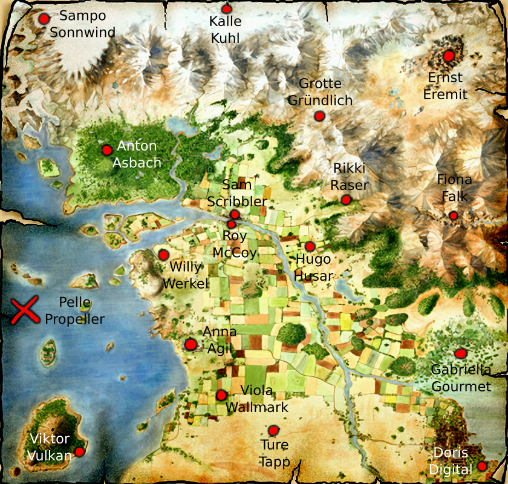
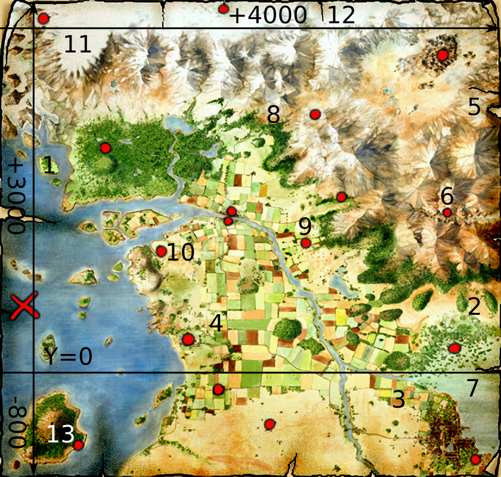

# "Flugzeuge bauen mit Willy Werkel" Documentation

All the information I found while reverse engineering and playing the game. It's also known as "Bygg flygplan med Mulle Meck" in swedish. 

## People

### Swedish Names

* Sampo Sonnwind -> Sampo Sanna
* Kalle Kuhl -> Brejton Bord
* Hugo Husar -> Atle Artillerist
* Rikki Raser -> Raymond Raser
* Grotte Gründlich -> Grotte Grundlig
* Pelle Propeller -> Vermont Vrak
* Anna Agil -> Emma Entreprenör
* Anton Asbach -> Richard Revers

## Map Locations

These are all the locations where you have to pick up items from the ground. The values in brackets are the X and Y coordinates and the third number is the radius for random positions. Locations close together only have one marker.

### Anton
* 1: Book (500, 1740) ø50

### Doris
* 2: Antenna 1 (3660, 680)
* 3: Antenna 2 (2963, -79)
* 4: Antenna 3 (1800, 206)

### Ernst
* 5: Metalsheets (3800, 2110)

### Fiona
* 6: Bird 1 (3686, 1450)
* 6: Bird 2 (3603, 1345)
* 6: Bird 3 (3554, 1382)

### Gabriella
* 7: Chair 1 (3660, 250) ø150
* 7: Chair 2 (3660, 0) ø150
* 7: Chair 3 (3460, 100) ø150
* 7: Chair 4 (3760, 0) ø150
* 7: Table 1 (3660, 200) ø150
* 7: Table 2 (3560, 50) ø150

### Grotte
* 8: Vacuumcleaner (2080, 2000) ø200

### Hugo
* 9: Meteorite Crater 1 (2500, 1300)
* 9: Meteorite Crater 2 (2500, 1080)
* 9: Meteorite Crater 3 (2410, 1060)

### Erik (Random events)
* 10: Mobile Phone (1855, 1441) ø1000
* 10: Clock (1855, 1441) ø1000
* 10: Hangglider (1855, 1441) ø1000
* 10: Sunglasses (1855, 1441) ø1000
* 10: Mobile Phone 2 (1855, 1441) ø1000

### Sampo
* 11: Reindeer (617, 2822) ø100

### Viktor
* 12: Seismograph Part 1 (2545, 2900) ø100
* 13: Seismograph Part 3 Bird (500, -200) ø20

## Difficult Missions

### Viola

* Spreading seeds: Attach the farming tool
* Water the field: Same as above
* Scare moles: Attach the nose that looks angry and has three spikes at the front

### Doris

* Antennas: Check my map

### Viktor

* Seismograph Part 1: Check my map

## New Parts

* Ture: Grappling Hook
* Pelle: Wing floats for landing on water
* Victor: Skis, VTOL parts and Mole Scarer

## Landing

* Sampo: Skis required
* Kalle: Skis required
* Fiona: Hook required. You can only land on the platform where the house it. There's an invisible line at half the height which you can collide with.
* Gabriella: Floats required
* Pelle: Hook required. Doesn't have a windsock, it's just a wooden rectangle moving around on the sea. You can land on the deck of the ship.
* Victor: Floats required

## Emulating the Game

I ran the game in a Windows XP VirtualBox. The 30-day trial period you get without a license key is more than enough to finish it. To get the sound working I had to disable VT-x/AMD-V and hardware acceleration in Windows, more details in my [blog post](http://yepoleb.github.io/blog/2016/08/31/fixing-sound-issues-with-virtualbox/). To fix the mouse pointer jumping around disable "Mouse Integration". The copy protection also required "Passthrough" to be enabled for my CD drive. A generic SafeDisc v2 patcher would probably work as well, but that's just for the bad guys.

## Scripts

Detailed descriptions of the file types are at the beginning of the scripts.

* uppackage.py: Unpacks the data.up, sounds.up and map.up packages used for game data.
* gtifile.py: An attempt to decode the .gti files used for textures, only works in a few cases.
* savefile.py: Reads some parts of the savefiles.

